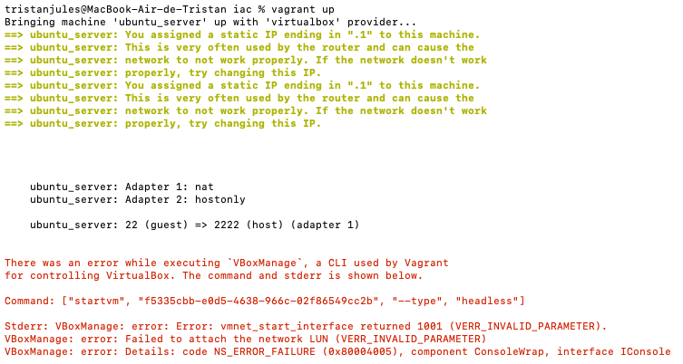
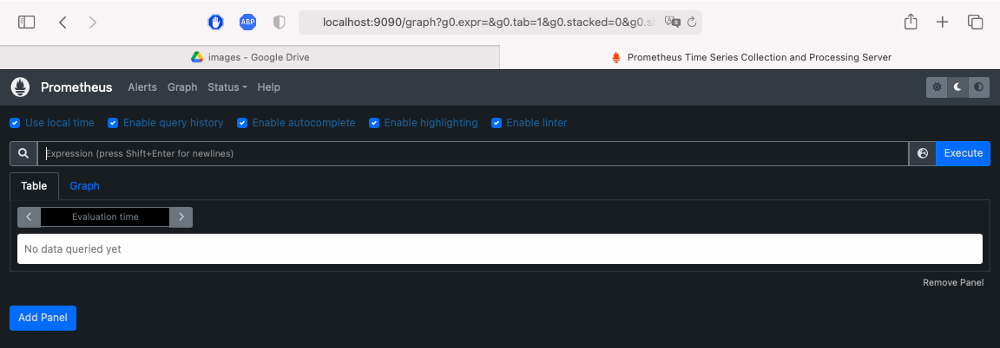

# DevOps Project Fall 2022

## Students: Thomas DU, Tristan JULES

This is our project for DevOps Fall 2022.<br/>
Many of the diverse tools that were discovered during the labs are used here.<br/>
Commands and screenshots of the terminal and results such as website pages are provided along the tasks.

## Install the project

To install the project, type the following command in your terminal:

   ```bash
  git clone https://github.com/julestristan/ece-devops-du-jules.git
  cd ece-devops-du-jules
   ```

## 1. Create a web application

Before running the commands, go to the userapi folder:

   ```bash
  cd userapi
   ```

Run the following command to execute the start script and exit with CTRL + C:

   ```bash
  npm start
   ```


Run the test:

   ```bash
  npm test
   ```


All 20 tests should be passing.

## 2. Apply CI/CD pipeline

### **Continuous Integration**

This part deals with Github Actions and the creation of a workflow for the project.
We created a workflow that we can deploy with Azure Microsoft(CD).

Workflow of the project:


Example of a recent commit change:


CI of the Workflow:


### **Continuous Delivery**

We deployed our app with Azure because we could not use Heroku with their new policy.

Here is the deployment we made using Azure Microsoft:


This is the result of a new commit with the Azure deployment:


## 3. Configure and provision a virtual environment and run your application using the IaC approach

We used the Vagrantfile to define how the VM will run.<br/>
The use of Ansible and the playbook is also defined in that file.<br/>
Then the use of vagrant up and vagrant ssh should allow to use the virtual environment.<br/>



Unfortunately we kept on having errors with vagrant and the use of "vagrant up"

## 4. Build Docker image of your application

To build an image of the application, run the following command in the root folder where the Dockerfile is located:

   ```bash
  docker build -t devops .
   ```


The image is now built.<br/>
You can run the application to see if it is working accordingly:


To push the image that we just built, we used these commands:

   ```bash
  docker tag devopsdj account/devopsdj
  docker login
  docker push account/devopsdj
   ```


Here is the result that we can check on <https://hub.docker.com>:


## 5. Make container orchestration using Docker Compose

Run the docker-compose.yaml file that is in the root folder using:

   ```bash
  docker-compose up 
   ```


The port to access the localhost is 5000 as stated in the docker-compose.yaml file: <localhost:5000>


The localhost website opens correctly.

## 6. Make docker orchestration using Kubernetes

Run the cluster and initiate Kubernetes by running this command:


Go to ./k8s/manifestfiles and apply all the manifest files:

   ```bash
  cd k8s/manifestfiles
  kubectl apply -f .
   ```


Now we can generate the URL to access our service devopsdj:

   ```bash
  minikube service devopsdj
   ```


The URL in the second table is the one we are able to connect to via a navigator:


## 7. Make a service mesh using Istio

First create a new kubernetes cluster:

   ```bash
  minikube delete
  minikube start 
   ```

Install istio:

   ```bash
  istioctl install --set profile=demo -y
   ```

Then we created and build an image of a second application (devopsdj2):

   ```bash
  docker build -t devops2 .
  docker tag devopsdj2 account/devops2
  docker login
  docker push account/devops2
   ```


Apply the destination.yaml, gateway.yaml and virtualservice.yaml manifest files.
We now have two versions (devopsdj and devopsdj2) that we want to perform service mesh on.<br/>
The manifest files (destination.yaml, gateway.yaml and virtualservice.yaml) allows to manage the microservices interactions. Weight can be defined for each version of the app depending on the traffic load.

   ```bash
   #From root
  cd istio-config/istio
  kubectl apply -f .
   ```


Check the ip and port to open the application on localhost (IP -> minikube ip; port -> 80 on istio-ingressgateway entry):


After launching the localhost with the according IP and port:


We did not figure out why the localhost did not open the application.

## 8. Implement Monitoring to your containerized application

In this part we want to setup Prometheus and Grafana for our project.<br/>
For both, you need to go to the ./k8s/monitoring folder from root folder:

   ```bash
  cd k8s/monitoring
   ```

### **Prometheus**

To configure Prometheus:

```bash
  kubectl apply -f .
  #you can check the port for localhost using the command: kubectl get svc -n istio-system
  kubectl port-forward svc/prometheus -n istio-system 9090
   ```


We can know open our navigator and check <http://localhost:9090>

Landing page:



Check the endpoints:


### **Grafana**

To configure Grafana:

```bash
  kubectl apply -f . 
  #you can check the port for localhost using the command: kubectl get svc -n istio-system
  kubectl port-forward svc/grafana -n istio-system 3000
   ```


We can know open our navigator and check <http://localhost:3000>


We can access to some detailed statistics regarding CPU, memory usage and more:

